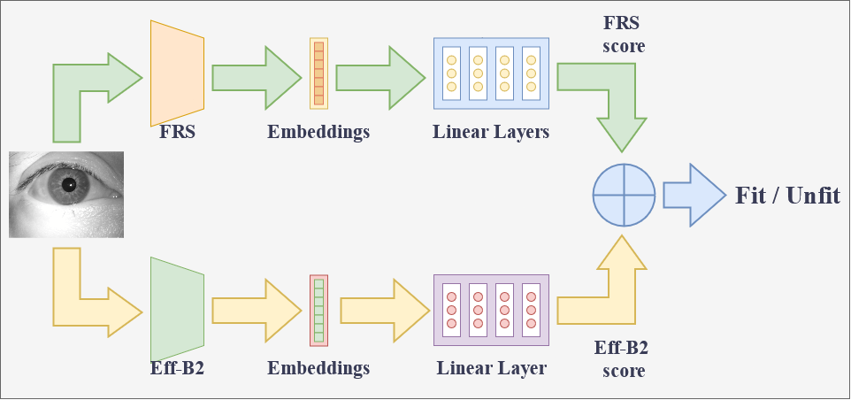

# FitIris-FRS
This repository contains some of the tools and the method developed for the paper: Can Face Recognition Complement the Iris Fitness for Duty Classification?.
## Introduction
## Tools
- [MagFace-repo](https://github.com/IrvingMeng/MagFace): This is the repository with the MagFace tool used.
- [AdaFace-repo](https://github.com/mk-minchul/AdaFace): This is the repository with the AdaFace tool used.
## Diagram

## Step by steps
These steps summarize the method developed for the paper <add_paper_name> for two subjects with one sample and applying the mean/max function between the scores of the Face Recognition Systems (FRS) and the CNN model.
### FRS
  1. Feature extraction with FRS (Adaface/Magface)
  2. Features transformation to dataframe
  3. Fitness for duty estimation with head
### EfficientNet-B2
  1. Fitness for duty estimation with EfficientNet-B2
### Score fusion
  1. Max or Mean calculation between scores (FRS and EfficientNet-B2)
## Example on Jupyter
To get a step-by-step example check the example_notebook.ipynb 
## Acknowledgements
## Cited
## Disclaimer
